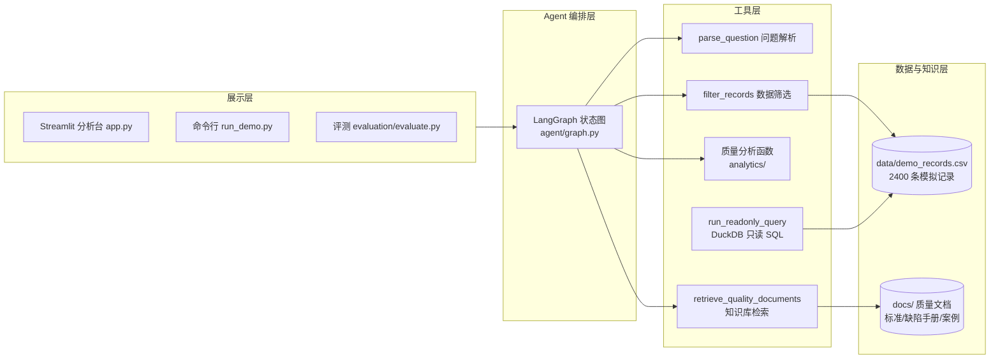
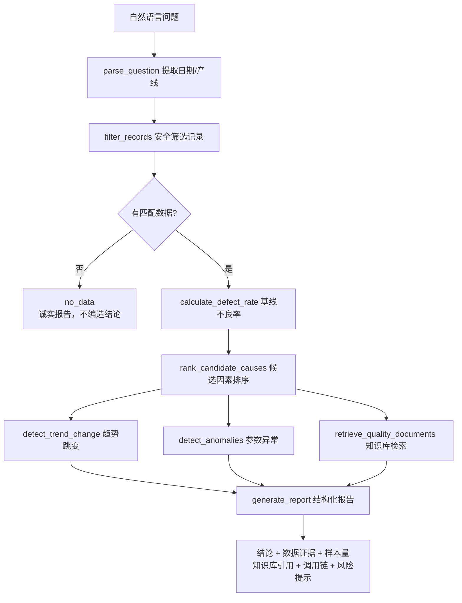

# Manufacturing Quality Root Cause Agent

面向新能源汽车制造场景的制造质量根因分析 Agent MVP。

当前版本不依赖外部大模型 API，使用确定性的规则解析、质量分析工具、LangGraph
编排和本地知识库检索完成完整演示。所有数字可复现、可测试、可追溯。

## 功能一览

- **自然语言提问**：可插拔 LLM 解析后端，支持标准日期、中文日期（1月1日）、
  车型（ID.4）和复合产线（A产线和B产线）；无 key 或连不上时自动回退规则解析。
  三种后端：`mock`（模拟器，默认）/ `ollama`（本地模型）/ `glm`（智谱云端）。
- **不良率分析**：计算指定范围的总不良率、缺陷数量、样本量。
- **候选因素排名**：按工位、班次、供应商、批次分组对比，排出最值得优先排查的
  前 3 个因素（带不良率、样本量、数据证据和人工确认建议）。
- **趋势跳变检测**：前后窗口对比，定位不良率突变发生的日期。
- **参数异常检测**：Isolation Forest 检出温度/压力/扭矩的离群记录（结果确定）。
- **知识库引用**：检索质量标准、缺陷代码手册和维修案例，回答附文档名与章节；
  检索不到时明确说明，不编造来源。
- **调用链追踪**：页面展示完整执行过程（解析 → 筛选 → 分析 → 知识库 → 报告），
  每次工具调用附记录，全流程可审计。
- **解析条件回显**：页面显示本次问题解析出的查询条件（日期范围/产线/车型），
  发现解析不对可以立即看到。
- **知识库引用卡片**：命中时以卡片展示文档名、章节和原文摘要；未命中明确说明。
- **只读 SQL 工具**：DuckDB 查询，表/列白名单，恶意 SQL 被拒绝。
- **固定问题集评测**：20 道题自动评测，统计完成率、准确率和响应时间。

## 快速运行

要求：Python 3.10 或更高版本。

### 可视化页面

最简单的方式是直接双击项目目录中的：

```text
start_dashboard.bat
```

也可以使用 PowerShell 手动启动。

安装页面依赖：

```powershell
python -m pip install streamlit pandas matplotlib duckdb scikit-learn langgraph
```

启动页面：

```powershell
python -m streamlit run app.py
```

浏览器打开 `http://localhost:8501`。

### 命令行版本

```powershell
python run_demo.py
```

也可以输入自己的问题：

```powershell
python run_demo.py "请分析 2026-01-01 到 2026-01-15 B产线的不良率异常"
```

第一次运行会生成 `data/demo_records.csv`。数据是可复现的模拟数据，不代表任何
真实企业生产数据。

### 评测

```powershell
python evaluation/evaluate.py
```

### 切换 LLM 解析后端

```powershell
# 模拟器（默认，规则解析，无需任何配置）
set QUALITY_LLM_PROVIDER=mock

# 本地 Ollama（需先安装 https://ollama.com 并拉取模型）
ollama pull qwen2.5:7b
set QUALITY_LLM_PROVIDER=ollama

# 智谱 GLM（免费模型，需注册 https://bigmodel.cn 获取 API key）
set QUALITY_LLM_PROVIDER=glm
set GLM_API_KEY=你的key
```

任何后端失败（网络、格式错、无 key）都会自动回退到规则解析，不影响使用。

## 运行测试

项目使用 Python 标准库 `unittest`：

```powershell
python -m unittest discover -s tests -v
```

## 系统架构



## Agent 执行流程



## 评测结果（2026-08-08，demo_records.csv，2400 条，mock 解析后端）

| 指标 | 结果 |
|---|---|
| 问题总数 | 22 |
| 任务完成率 | 22/22 = 100% |
| 数值准确率 | 14/14 = 100% |
| 平均响应时间 | 约 5.8 ms |
| 状态分布 | success 20，no_data 2 |

## 成功与失败案例

详见 [docs/cases.md](docs/cases.md)。摘要：

**成功案例**
1. A 产线 1 月上半月分析：命中 W-07（19.72%）、Night（10.44%）、S-03（10.14%），
   与数据中注入的缺陷模式一致，知识库自动引用对应维修案例。
2. 趋势跳变检测：自动定位到 2026-01-16 前后不良率跳变 +3.76 个百分点。
3. 无数据场景：2027 年查询返回 `no_data` 并明确说明，不编造结论。

**已修复的失败案例（LLM 解析后端）**
1. 车型问题：`ID.4 车型` 现在能正确解析为 `vehicle_model=ID.4`。
2. 中文日期：`1月1日到1月15日` 现在能正确转换为 `2026-01-01 ~ 2026-01-15`。
3. 复合产线：`A产线和B产线` 现在解析为 `["A", "B"]`，两条产线都参与统计。

## 代码结构

```text
analytics/quality_analysis.py  纯 Python 质量分析函数
analytics/trend_analysis.py    不良率趋势跳变检测（前后窗口对比）
analytics/anomaly_detection.py Isolation Forest 工艺参数异常检测
data/demo_data.py              可复现模拟数据和 CSV 读写
docs/                          质量知识库（标准/缺陷手册/维修案例）与项目文档
rag/ingest.py                  知识文档切分与索引（显式文件名白名单）
rag/retriever.py               字符 bigram 确定性检索
tools/quality_tools.py         Agent 可调用的数据筛选工具
tools/sql_tool.py              DuckDB 只读 SQL 查询工具（表/列白名单）
tools/anomaly_tool.py          趋势/异常检测的 Agent 调用包装层
tools/knowledge_tool.py        知识库检索工具（无命中时明确说明）
agent/workflow.py              Agent 公共入口和报告渲染（兼容层）
agent/graph.py                 LangGraph 节点图（parse→query→analyze→knowledge→report）
agent/state.py                 LangGraph 状态定义
agent/llm_parser.py            可插拔 LLM 解析（mock/ollama/glm，自动回退规则）
app.py                         Streamlit 可视化分析台
run_demo.py                    命令行入口
evaluation/cases.json          固定问题集（20 题）
evaluation/evaluate.py         评测：任务完成率/数值准确率/响应时间
tests/                         单元测试（49 个）
tasks/plan.md                  切片二至六的开发规格与验收记录
```

## 简历项目描述

> 面向新能源汽车制造质量场景，基于 LangGraph 设计制造质量根因分析 Agent，
> 集成 DuckDB SQL 查询、异常检测、质量知识库 RAG 和结构化报告生成工具；支持
> 按产线、工位、班次和供应商分析不良率异常，输出候选影响因素、数据证据及
> 相关质量案例，并通过固定问题集评估任务完成率和引用准确率。

## 下一步扩展

1. 接入真实 LLM（Ollama/GLM 后端已就绪，配置环境变量即可启用），
   支持 Function Calling 和对话记忆。
2. 为 Agent 增加人工确认节点、工具失败重试和结构化日志。
3. 使用 DuckDB/PostgreSQL 替代直接加载 CSV 到内存。
4. 知识库升级为 embedding 向量检索，并接入大模型生成自然语言结论。
5. 用 AI4I 等真实数据集替换模拟数据，做进阶演示。
6. 增加 Docker 部署和可观测性（调用链、耗时、成本统计）。

## 重要限制

候选因素是基于分组统计差异的优先级排序，不等于已证明的因果关系。进入真实
生产环境前，需要接入经过授权的数据、权限控制、人工审核和更严格的工业安全
流程。当前问题解析仅支持有限的日期格式和产线词汇，详见 docs/cases.md。
